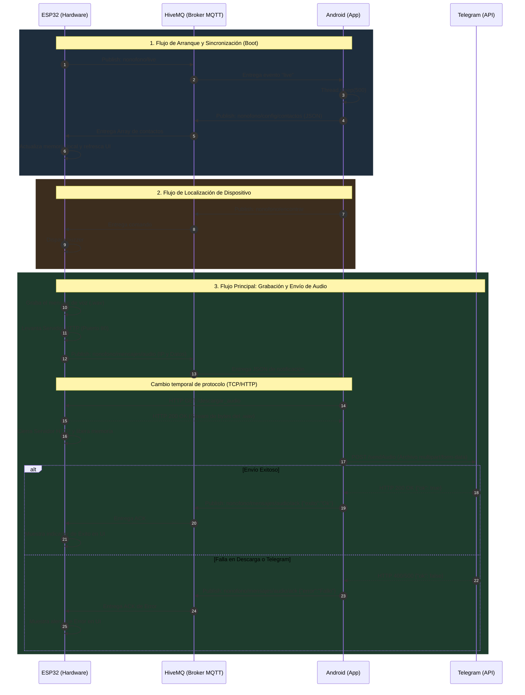

```mermaid
sequenceDiagram
    autonumber
    participant ESP as ESP32 (Hardware)
    participant BRK as HiveMQ (Broker MQTT)
    participant APP as Android (App)
    participant TEL as Telegram (API)


    %% Fase 1: Arranque y Sincronización
    rect rgb(30, 45, 60)
    Note over ESP, APP: 1. Flujo de Arranque y Sincronización (Boot)
    ESP->>BRK: Publish: nonofono/live
    BRK->>APP: Entrega evento "live"
    APP->>APP: Thread.sleep(500)
    APP->>BRK: Publish: nonofono/config/contactos (JSON)
    BRK->>ESP: Entrega Array de contactos
    ESP->>ESP: Actualiza memoria local y refresca UI
    end


    %% Fase 2: Localización
    rect rgb(60, 45, 30)
    Note over ESP, APP: 2. Flujo de Localización de Dispositivo
    APP->>BRK: Publish: nonofono/encontrar
    BRK->>ESP: Entrega comando
    ESP->>ESP: Dispara buzzer
    end


    %% Fase 3: Transmisión de Audio y Confirmación
    rect rgb(30, 60, 45)
    Note over ESP, TEL: 3. Flujo Principal: Grabación y Envío de Audio
    ESP->>ESP: Graba el mensaje de voz (.wav)
    ESP->>ESP: Levanta Servidor HTTP (Puerto 80)
    ESP->>BRK: Publish: nonofono/mensajes/audio (IP y Datos)
    BRK->>APP: Entrega JSON de notificación
   
    Note over ESP, APP: Cambio temporal de protocolo (TCP/HTTP)
    APP->>ESP: HTTP GET /descargar_audio
    ESP-->>APP: HTTP 200 OK (Stream de bytes del .wav)
    ESP->>ESP: Cierra Servidor HTTP y libera memoria
   
    APP->>TEL: POST /sendAudio (Archivo multipart/form-data)
   
    alt Envío Exitoso
        TEL-->>APP: HTTP 200 OK {"ok": true}
        APP->>BRK: Publish: nonofono/mensajes/audio/ack {"exito":"Ok"}
        BRK->>ESP: Entrega ACK
        ESP->>ESP: Muestra indicador de Éxito en UI
    else Falla en Descarga o Telegram
        TEL-->>APP: HTTP 400/500 {"ok": false}
        APP->>BRK: Publish: nonofono/mensajes/audio/ack {"error":"Fallo"}
        BRK->>ESP: Entrega ACK de Error
        ESP->>ESP: Muestra alerta de Error en UI
    end
    end

```