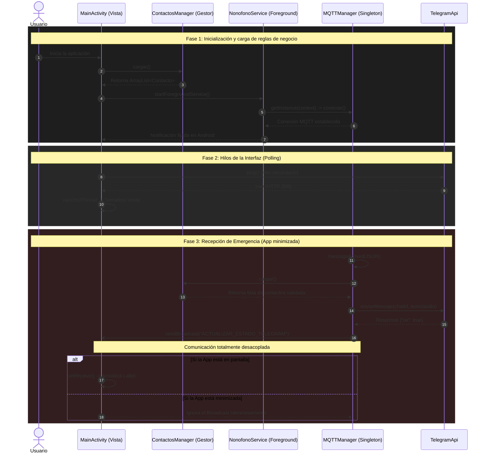

```mermaid
sequenceDiagram
    autonumber
    actor U as Usuario
    participant UI as MainActivity (Vista)
    participant G as ContactosManager (Gestor)
    participant FS as NonofonoService (Foreground)
    participant MQ as MQTTManager (Singleton)
    participant API as TelegramApi


    %% Fase 1: Arranque
    rect rgb(30, 30, 30)
    Note over U, API: Fase 1: Inicialización y carga de reglas de negocio
    U->>UI: Inicia la aplicación
    UI->>G: cargar()
    G-->>UI: Retorna ArrayList<Contacto>
    UI->>FS: startForegroundService()
    activate FS
    FS->>MQ: getInstance(context) -> conectar()
    activate MQ
    MQ-->>FS: Conexión MQTT establecida
    FS-->>UI: Notificación fijada en Android
    end


    %% Fase 2: Polling Visual
    rect rgb(40, 40, 40)
    Note over U, API: Fase 2: Hilos de la Interfaz (Polling)
    UI->>API: ping() (Hilo secundario)
    API-->>UI: true (HTTP 200)
    UI->>UI: runOnUiThread -> Semáforo Verde
    end


    %% Fase 3: Evento Asíncrono
    rect rgb(50, 30, 30)
    Note over U, API: Fase 3: Recepción de Emergencia (App minimizada)
    MQ->>MQ: messageArrived(JSON)
    MQ->>G: cargar()
    G-->>MQ: Retorna lista de contactos validada
    MQ->>API: enviarMensaje(chatId, texto/audio)
    API-->>MQ: Response {"ok": true}
   
    %% La magia del desacoplamiento
    MQ-)UI: sendBroadcast("ACTUALIZAR_ESTADO_TELEGRAM")
    Note over MQ,UI: Comunicación totalmente desacoplada
   
    alt Si la App está en pantalla
        UI->>UI: onReceive() -> Actualiza Label
    else Si la App está minimizada
        UI--xMQ: Ignora el Broadcast silenciosamente
    end
    end

```